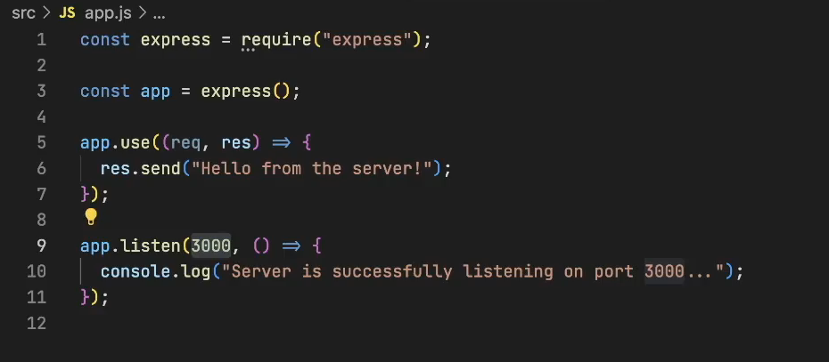
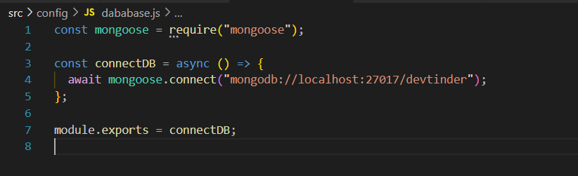
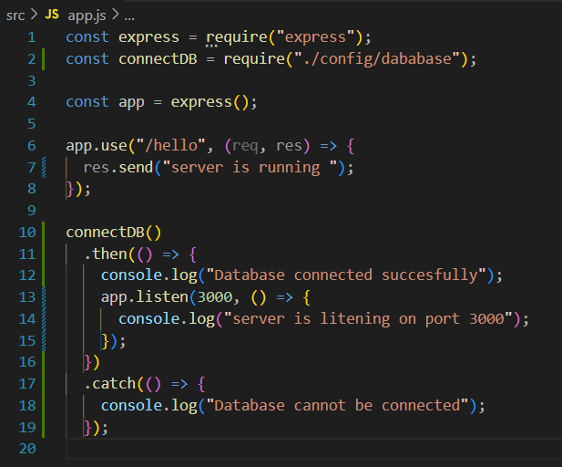
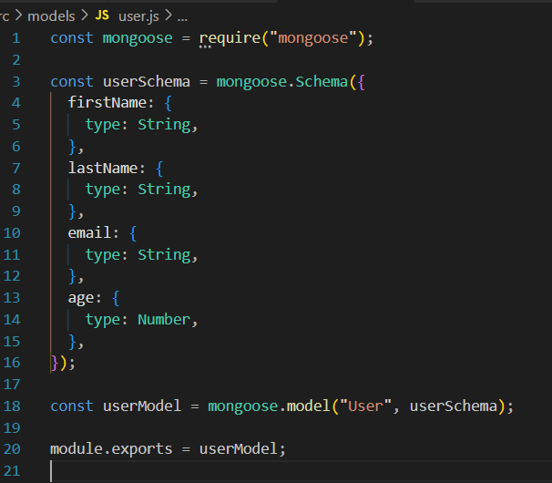
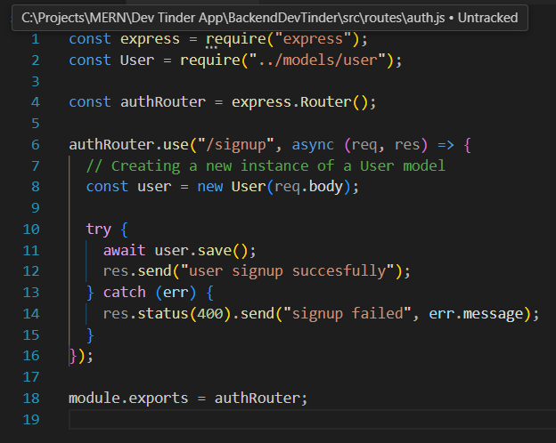

# Project setup

- npm init
- Folder > src > app.js
- Install Express
- Create .gitignore file > node_modules
- In App.js create server
- 
  <!-- -  -->
- Install nodemon

# Git

- Create a git repositary
- Push the code

# Cluster

- Go to mongoDB website
- Create a free M0 cluster
- Create user
- Get the connection string

# MongoDB

- Create a config folder > database.js
- Install mongoose
- in database.js > import mongoose > create async connectDB function > paste dabaseURL mongoDB shell
- 
- Export connectDB function to app.js(so that first we will connect to database and then will run the server)
- 

# Postman

- After creating the differnt api's
- Start Testing on postman
- Workspace > black collection > New > HTTP

# REST API's

- Get, Post, Patch, Delete

# Middleware's

- Create a folder middleware in src folder
- Write a middleware (Middleware > auth.js) for different routes
- To use middleware for route,export from middleware file
- Import middleware in route file and write after the path (eg "./test",userAuth,()={})

# Schemas & Models

- Create a models folder > user.js file
- Write the following code
- 

# API's

- Create a Route folder > auth.js file
- Import express > declare route > write a indivisual route > export the route
- 

- Will start writing API'S
- Import User model in API
- for eg we will write signup API
- Here we will create new instance of User model by following image code
- To make it dynamic we will use req.body

---

- To make the API working import it in app.js
- To convert the request data into JSON format add a middleware app.use(express.json())
- Declare a router
- Use the app.use("/") to direct the route to indivisual route
